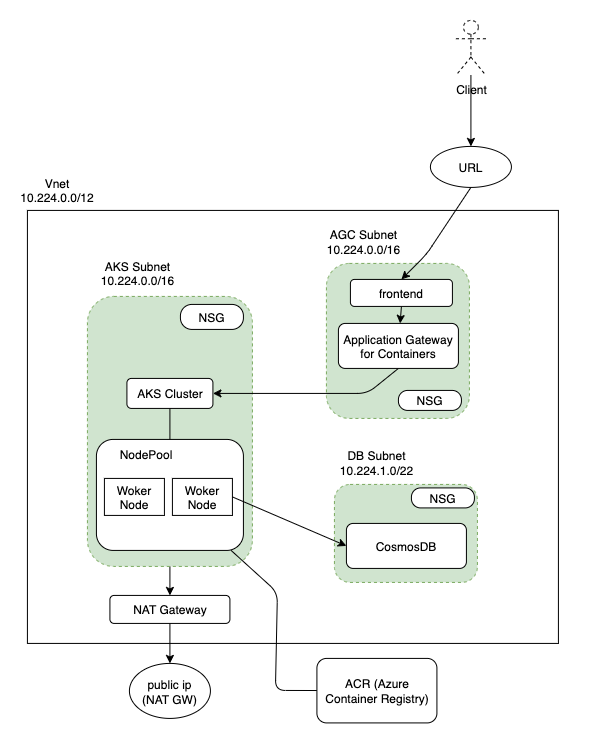

```
  _   _         ______                  _____              _  
 | \ | |       |  ____|                |  __ \            | | 
 |  \| | ___   | |__   __ _ ___ _   _  | |  | | __ _ _   _| | 
 | . ` |/ _ \  |  __| / _` / __| | | | | |  | |/ _` | | | | | 
 | |\  | (_) | | |___| (_| \__ \ |_| | | |__| | (_| | |_| |_| 
 |_| \_|\___/  |______\__,_|___/\__, | |_____/ \__,_|\__, (_) 
                                 __/ |                __/ |   
                _               |___/                |___/    
               | |               | |                          
  ______    ___| | ___  _   _  __| |   ___  _ __  ___         
 |______|  / __| |/ _ \| | | |/ _` |  / _ \| '_ \/ __|        
          | (__| | (_) | |_| | (_| | | (_) | |_) \__ \        
           \___|_|\___/ \__,_|\__,_|  \___/| .__/|___/        
                                           | |                
                                           |_|                
```

# Azure Cloud 

본 내용은 CSP 별 공통적으로 존재하는 리소스를 생성하고 간단히 앱 배포하여 연동해보는 예제를 담는다.

여기서는 Azure cloud 에 대해서 다룬다.

  

#### 생성 리소스

- Virtual Network : Vnet
- Subnet
- Security Group : NSG
- Private Container Registry : ACR (Azure Container Registry)
- Kubernetes : AKS (Azure Kubernetes Service)
- Load Balancer : Application Gateway for Containers
    - Workload Identity and Service Identity?
- Application : Nginx APP
- Cosmos DB

  

  

  


# Azure login


```
az login
az account list -o table
az account show --query id --output tsv
```

  

  

#### 구독 지정

```
SUBSCRIPTION=$(az account show --query id --output tsv)
az account set -s $SUBSCRIPTION
```

  

  

### azure resource group 확인

```
az group list --output table
RESOURCE_GROUP='01_dustinAksRg_1'

az group show --name $RESOURCE_GROUP --output table

# azure resource 확인 (특정 resource group 에 속한)
az resource list --resource-group $RESOURCE_GROUP --output table
```


# AKS 리소스 그룹 생성하기


```
ClusterIndex='-cl02'
```

  

  

### 리소스 그룹 생성

```
RESOURCE_GROUP='01-dustinAksRg'$ClusterIndex
LOCATION='koreacentral'
az group create -n $RESOURCE_GROUP -l $LOCATION
#az group update --resource-group $RESOURCE_GROUP --set tags.CostCenter='{"Dept":"IT","Environment":"Test"}'
```

  

  

### Provider register 목록확인 (리소스 공급자가 등록되어 있어야 함)

```
az provider list --query "[?registrationState=='Registered'].{Provider:namespace, Status:registrationState}" --out table
az provider list --out table
```

  

  

### Provider register 등록

```
az provider register -n Microsoft.OperationsManagement
az provider register -n Microsoft.OperationalInsights
az provider register -n Microsoft.ContainerService
az provider register -n Microsoft.ContainerRegistry
```

  

### 리소스 그룹 삭제

```
az group delete -n $RESOURCE_GROUP --no-wait --yes
```


### ACR 생성

```
Ref.
 - https://microsoftlearning.github.io/AZ500-AzureSecurityTechnologies.ko-kr/Instructions/Labs/LAB_04_ConfiguringandSecuringACRandAKS.html
### This is mandantory link which you must see.

# Azure Container Registry 생성
ACR_NAME='dustinacr01'
az acr create -g $RESOURCE_GROUP -n $ACR_NAME \
--sku Basic --admin-enabled true
```

  

  
  

### ACR 자격 증명 가져오기

```
ACR_PASSWORD=$(az acr credential show -n $ACR_NAME \
--query "passwords[0].value" -o tsv)

LOGIN_SERVER=$(az acr show -n $ACR_NAME \
--query loginServer -o tsv)
```

  

  

### ACR 목록 확인

```
az acr list --resource-group $RESOURCE_GROUP --output table
```

  

  

### ACR 로그인 서버 확인

```
az acr show --name $ACR_NAME --query loginServer
az acr repository list -n $ACR_NAME
```

  

  


### Container Image 생성 및 ACR 에 업로드

\# 1. Dockerfile 생성

\# 2. Container Image Build

\# 3. ACR 에 Image upload


```
Ref.
 - https://microsoftlearning.github.io/AZ500-AzureSecurityTechnologies.ko-kr/Instructions/Labs/LAB_04_ConfiguringandSecuringACRandAKS.html


# index.html 파일 생성
<!doctype html>
<html lang="en">
<head>
<meta charset="utf-8">
<title>Azure Container Instance</title>
</head>
<body>
<h1>Simple static website</h1>
<h2>Welcome to Azure Container Instances</h2>
</body>
</html>

# Dockerfile 작성
FROM nginx:latest
COPY ./index.html /usr/share/nginx/html/index.html

# Dockerfile에서 ACR로 이미지 빌드 및 푸시
#### 이 명령은 로컬에 docker 설치가 필요없음
#### . : 로컬 소스 디렉토리 경로 혹은 Git 리포지토리에 대한 URL임. 원격 tarball, Azure Container Registry 의 OCI 아티팩트 리포지토리를 지정할 수 있음.
image="myweb:1.0"
az acr build --image $image --registry $ACR_NAME \
--file Dockerfile_web .

image="nginx:v1"
az acr build --image $image --registry $ACR_NAME \
--file Dockerfile_nginx .
```

  

### ACR 이미지 확인

```
az acr repository list -n $ACR_NAME -o table
```

  

  

### ACR 의 컨테이너 이미지 삭제

```
az acr repository delete --name $ACR_NAME --image myweb:1.0
az acr repository delete --name $ACR_NAME --image nginx:
```

  

  

### ACR에 푸시한 이미지 실행

```
az acr run -r $ACR\_NAME --cmd 'docker run -d $Registry/myweb:1.0' /dev/null
```


### Docker Hub 에 있는 컨테이너 이미지를 ACR 로 복사하기


```
az acr import --name $ACR_NAME --source docker.io/library/nginx:latest --image nginx:v1
```


# AKS 생성


  

### 변수 설정 for aks ap02

```
RESOURCE_GROUP='01_dustinAksRg'$ClusterIndex
AKS_CLUSTER_NAME='dustinaks-cluster-ap02'$ClusterIndex
SUBSCRIPTION=$(az account show --query id --output tsv) # multicloud enabling
VNET_NAME='dustinVnet_ap01'
SUBNET_NAME_NODE=$PRIV_SUB_NET1
SUBNET_NAME_POD=$PRIV_SUB_NET2
LOCATION='koreacentral'
NODE_COUNT=3
MAX_PODS=250
```

  

  
  

### AKS Cluster cl02 생성

- Vnet, AKS Subnet, NSG 자동생성됨

  

```
az aks create \
--name $AKS_CLUSTER_NAME \
--resource-group $RESOURCE_GROUP \
--location $LOCATION \
--max-pods $MAX_PODS \
--node-count $NODE_COUNT \
--network-plugin azure \
# --enable-addons monitoring \
# --vnet-subnet-id /subscriptions/$SUBSCRIPTION/resourceGroups/$RESOURCE_GROUP/providers/Microsoft.Network/virtualNetworks/$VNET_NAME/subnets/$SUBNET_NAME_NODE \
# --pod-subnet-id /subscriptions/$SUBSCRIPTION/resourceGroups/$RESOURCE_GROUP/providers/Microsoft.Network/virtualNetworks/$VNET_NAME/subnets/$SUBNET_NAME_POD \
--enable-managed-identity \
--generate-ssh-keys
```

  

  

### AKS 목록 확인

```
az aks list --resource-group $RESOURCE_GROUP -o table
```

  

  
  

\# 서브넷 ID 가져오기

\# SUBNET\_ID=$(az network vnet subnet show \\

\# --resource-group $RESOURCE\_GROUP \\

\# --vnet-name $VNET\_NAME \\

\# --name $SUBNET\_NAME \\

\# --query id -o tsv)

  

### AKS 클러스터 연결 (k9s, kubectl 사용가능하게 됨.)

```
az aks get-credentials -g $RESOURCE_GROUP -n $AKS_CLUSTER_NAME
az aks show -g $RESOURCE_GROUP -n $AKS_CLUSTER_NAME --query "networkProfile.vnetSubnetId" -o tsv
```

  

  

### AKS Cluster 삭제

```
az aks delete --resource-group $RESOURCE_GROUP --name $AKS_CLUSTER_NAME --yes --no-wait
```

  

  

  


# AKS 에 ACR 연결하기


```
Ref.
 - [https://learn.microsoft.com/ko-kr/azure/aks/cluster-container-registry-integration?tabs=azure-cli](https://learn.microsoft.com/ko-kr/azure/aks/cluster-container-registry-integration?tabs=azure-cli) (Good)

 - [https://microsoftlearning.github.io/AZ500-AzureSecurityTechnologies.ko-kr/Instructions/Labs/LAB\_04\_ConfiguringandSecuringACRandAKS.html](https://microsoftlearning.github.io/AZ500-AzureSecurityTechnologies.ko-kr/Instructions/Labs/LAB_04_ConfiguringandSecuringACRandAKS.html)
```


### ACR_NAME 가져오기

```
ACR_NAME=$(az acr list --resource-group $RESOURCE_GROUP --query '[].{Name:name}' --output tsv)
```

  

### AKS 에 ACR 연결

```
az aks update --resource-group $RESOURCE_GROUP --name $AKS_CLUSTER_NAME --attach-acr $ACR_NAME
```

  

  
  

# AKS 에 ACR 접근을 위한 Role 할당 -> 이걸로 ImagePullBackOff 가 해결 안됨.

```
AKS_VNET_ID=$(az network vnet show --name $VNET_NAME --resource-group $RESOURCE_GROUP --query id -o tsv)
AKS_MANAGED_ID=$(az aks show --name $AKS_CLUSTER_NAME --resource-group $RESOURCE_GROUP --query identity.principalId -o tsv)
az role assignment create --assignee $AKS_MANAGED_ID --role "Contributor" --scope $AKS_VNET_ID


az acr login -n dustinacr01 --expose-token
```

  

  


# ACR 이용해서 AKS 에 NGINX 배포 (Deployment)

Ref: [https://kubernetes.io/docs/reference/kubectl/generated/kubectl\_create/kubectl\_create\_deployment/#examples](https://kubernetes.io/docs/reference/kubectl/generated/kubectl_create/kubectl_create_deployment/#examples)


```
kubectl create deployment my-web --image dustinacr01.azurecr.io/myweb:1.0 --replicas=3
```